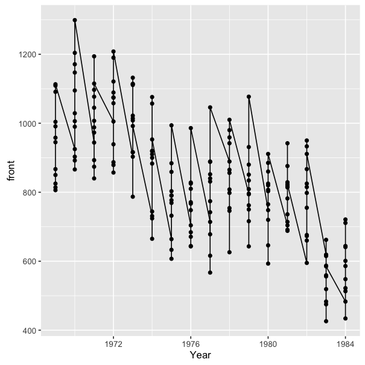
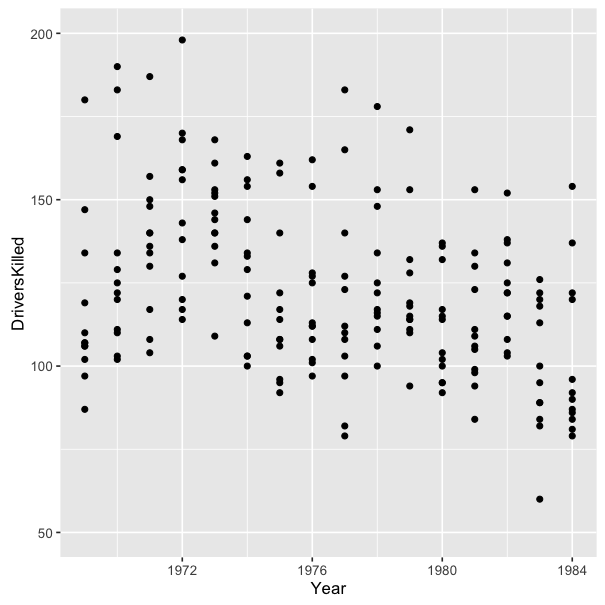

The Grammar of Graphics: Designing and Transforming Data
========================================================
author: Sandhya Kambhampati 
date: Jan 27, 2019
font-family: 'Helvetica'

What is R?
========================================================
<br>
"R is a language and environment for statistical computing and graphics" 

Source: R-project.org 

What is ggplot2?
========================================================
* *ggplot2* is a data visualization package for R
  + developed by Hadley Wickham
  + inspired by Leland Wilkinson's "The Grammar of Graphics"
  + provides an organizing philosophy for building graphs -- a structured approach to graphing
</br>

> "The emphasis in *ggplot2* is reducing the amount of thinking time by making it easier to go from the plot in your brain to the plot on the page."

> Wickham, 2012

The philosophy of ggplot2
========================================================
* A *ggplot2* graph is built up from a few basic elements:
  + **Data**: the raw data you want to plot
  + **Aesthetics**: including **Mapping** e.g., which variable is on the x-axis? the y-axis? Should the color/size/position of the plotted data that be mapped to some variable? (basically something you can see)
  + **Geometries**: the geometric shapes that represent the data
  + **Statistics**: statistical transformations that are used to summarize the data

Source: [Hopper (2014)] (http://tomhopper.me/2014/03/28/a-simple-introduction-to-the-graphing-philosophy-of-ggplot2/)

Things to know
========================================================
- Columns of data are mapped to aesthetics
- Legend maps the visual element and the data values
- Can't create interactive graphics (see the ggvis package for this)

Things to know
========================================================
- Non-data related aspects controlled by theme
  - background
  - size of title
  - font of the tick labels
  - legend location 
  
Structure of the code
========================================================

```r
ggplot(data = <data set>, 
       aes(x = <x axis variable>,
           y = <y axis variable>,
           <other aesthetic mappings>),
       <other plot defaults>) 
```
How to install ggplot2
========================================================
<br>

```r
#install the package
install.packages("ggplot2")

#load the package into your current project
library(ggplot2)
```

<br>
Make sure you have the most recent version of R to get the most recent version of *ggplot2*

The Data: Road Casualties in Great Britain 1969–84
========================================================

```r
data(Seatbelts)
s <- as.data.frame(Seatbelts)
```
Add in the time series data 
========================================================

```r
ts <- data.frame(Year=floor(time(Seatbelts)),
Month=factor(cycle(Seatbelts),
labels=month.abb), Seatbelts)
```
The Data: Road Casualties in Great Britain 1969–84
========================================================
* **DriversKilled**: car drivers killed
* **drivers**: monthly totals of car drivers in Great Britain killed or seriously injured Jan 1969 to Dec 1984
* **front**: front-seat passengers killed or seriously injured
* **rear**: rear-seat passengers killed or seriously injured
* **kms**: distance driven
* **PetrolPrice**: price of petrol
* **VanKilled**: number of van (‘light goods vehicle’) drivers
* **law**: 0/1: was the law in effect that month?

<br>
Source: UK Driver Deaths via [R datasets](https://stat.ethz.ch/R-manual/R-devel/library/datasets/html/UKDriverDeaths.html)

Look at your data
========================================================
```
head(ts)
```

How to plot your data: quick plot
========================================================


```r
qplot( data = ts,x= Year,y= DriversKilled, main= "Drivers Killed by Year")
```


Basic Features of ggplot2
========================================================
* Scatter Plot (geom_point)
* Bar Graph (geom_bar)
* Line Graph (geom_line)

Scatter Plot
========================================================


```r
ggplot(data = ts, 
       aes(x = Year, 
           y = DriversKilled)) + 
  geom_point() +
  ggtitle("Drivers killed by Year")
```

Scatter Plot
========================================================


Notice something?
========================================================

```r
qplot( data = ts,
       x= Year,
       y= DriversKilled,
       main= "Drivers Killed by Year")
```


```r
ggplot(data = ts, 
       aes(x = Year, 
           y = DriversKilled)) + 
  geom_point() +
  ggtitle("Drivers killed by Year")
```

Bar Graph - simple
========================================================

```r
ggplot(data = ts, 
       aes(x = Year, 
           y = VanKilled)) +
  geom_bar(stat = 'identity')
```

Bar Graph - simple
========================================================


Line Graph
========================================================

```r
ggplot(data = ts, 
       aes(x = Year, 
           y = front)) +
  geom_point() +
  geom_line()
```

Line Graph
========================================================


Now, let's make the charts a little more easy to read 
========================================================

Scatter Plot - relabel y-axis
========================================================

```r
ggplot(data = ts, 
       aes(x = Year, 
           y = DriversKilled)) + 
  geom_point() +
  scale_y_continuous(limits = c(50,200))
```

Scatter Plot - relabel y-axis
========================================================


Scatter Plot - color mapped to month
========================================================

```r
ggplot(data = ts, 
       aes(x = Year, 
           y = DriversKilled, 
           color = Month)) + 
  geom_point() 
```

Scatter Plot - color mapped to month
========================================================


Bar Graph - simple, transparent background
========================================================

```r
ggplot(data = ts, 
       aes(x = Year, 
           y = VanKilled)) +
  geom_bar(stat = 'identity') +
  theme(panel.background = element_blank())
```

Bar Graph - transparent background
========================================================

The philosophy of ggplot2 - recap
========================================================
* A *ggplot2* graph is built up from a few basic elements:
  + **Data**: the raw data you want to plot
  + **Aesthetics**: including **Mapping** e.g., which variable is on the x-axis? the y-axis? Should the color/size/position of the plotted data that be mapped to some variable?
  + **Geometries**: the geometric shapes that represent the data
  + **Statistics**: statistical transformations that are used to summarize the data

Source: [Hopper (2014)] (http://tomhopper.me/2014/03/28/a-simple-introduction-to-the-graphing-philosophy-of-ggplot2/)

Advanced Features
========================================================
* Text Labels
* Facetting
* Fitted Lines

Text Labels 
========================================================

```r
ggplot(data = ts, 
       aes(x = Month, 
           y = DriversKilled)) +
        geom_text(aes(label = Year), size = 2) 
```
Text Labels
========================================================

Facetting
========================================================

* Facetting allows you to split up your data by one or two variables
* *facet_grid()* places one or two variables in either vertical or horizontal directions
* *facet_wrap()* places facets next to each other, wrapping with a certain # of rows and/or columns

```
facet_grid(vertical ~ horizontal)

facet_wrap(~ variable, nrow = ___, ncol = ___)
```

Advanced Line Graph
========================================================

```r
ggplot(data = ts, 
       aes(x = Year, 
           y = DriversKilled)) + 
  geom_line() +
  facet_wrap(~ Month)
```

Advanced Line Graph
========================================================


Fitted Lines
========================================================
* How do we draw a fitted line through these points?


Fitted Lines
========================================================

```r
ggplot(data = ts, 
       aes(x = Year, 
           y = DriversKilled)) + 
  geom_point() +
  stat_smooth(method = 'lm')
```

Fitted Lines
========================================================


Now, let's combine those advanced features
========================================================

```r
ggplot(data = ts, 
       aes(x = Year, 
           y = DriversKilled)) + 
  geom_line() +
  facet_wrap(~ Month) + 
  stat_smooth(method = 'lm')
```

Advanced Line Graph
========================================================


Resources
======================================================
* ["A Layered Grammar of Graphics"](http://vita.had.co.nz/papers/layered-grammar.html) by Hadley Wickham

* ["A Simple Introduction to the Graphing Philosophy of ggplot2"](http://tomhopper.me/2014/03/28/a-simple-introduction-to-the-graphing-philosophy-of-ggplot2/) by Tom Hopper

* [ggplot2 Cheat Sheet](https://www.rstudio.com/wp-content/uploads/2015/03/ggplot2-cheatsheet.pdf) by RStudio

* [ggplot2 Documentation](http://docs.ggplot2.org/current/) by Hadley Wickham & Winston Chang

* [Shapes and Line Types in R](http://www.cookbook-r.com/Graphs/Shapes_and_line_types/) by Winston Chang

Thank You + Questions
======================================================
<br>

<center>
Sandhya Kambhampati    
[@sandhya__k](https://twitter.com/sandhya__k)

</center>
