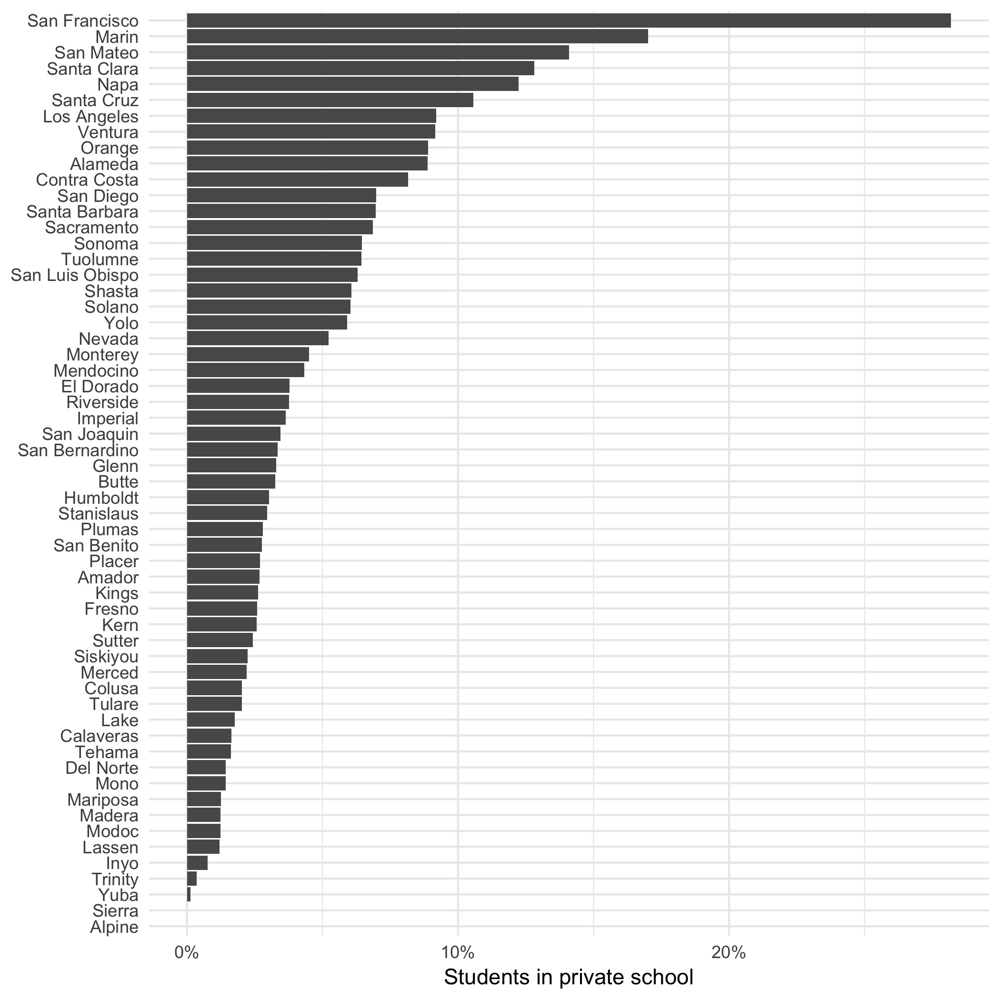

```{r setup, include=FALSE}
knitr::opts_chunk$set(echo = TRUE)

library(dplyr)
library(here)
library(readxl)
library(readr)
library(stringr)
library(tidyr)
library(ggplot2)

# turn off scientific notation
options(scipen=999)
```

THIS IS VERSION HAS WORKED EXAMPLES.
DURING CLASS, PLEASE USE THE OTHER VERSION.


# About the data

Data on school enrollment is available from the California Department of Education. Several files were downloaded and saved in the data subfolder.
  - Private school enrollment data: https://www.cde.ca.gov/ds/si/ps/ 
  - Public school enrollment data: https://www.cde.ca.gov/ds/sd/sd/filesenr.asp 

# Background & Questions

I'm interested to know which counties in California have the most students in private school. Let's find out!

# Read in and explore private school data

This data is in an Excel file. We can use the read_xls function from the readxl package to read in the data.  

```{r}
priv <- here("privateSchools/data/privateschools1617.xls") %>% 
  read_xls(
    # The skip argument tells R not to read in the first three rows
    skip = 3
    )
```


Now your turn!
* 2 minutes *
Get familiar the priv data frame. Use any functions or techniques you like. (Hint: View(), head(), colnames(), and count() are good places to start!).

What information is there? What structure is the data in?

```{r}
head(priv)
colnames(priv)
```


Wow, that's a lot of columns! Let's just keep the columns we care about.

```{r}
priv2 <- priv %>% 
  # R will let you have spaces in your column names, but the spaces can be a pain to work with. 
  # here we replace any spaces in the column name with an underscore
  rename_all(funs(stringr::str_replace_all(.," ","_"))) %>% 
  # choose just the columns we want to keep
  select(Affidavit_ID,
    County,
    CDS_Code,
    School,
    Public_District,
    Total_Enrollment,
    Religious_Classification,
    Religious_Denomination
  ) 

```


Now, let's explore the data structure a little more. Is there an ID column that's unique for each row?

```{r}
priv2 %>% nrow() 
priv2 %>% select(Affidavit_ID) %>% n_distinct() 
priv2 %>% select(CDS_Code) %>% n_distinct() 
```

What values are in the Religious classificaiton and denomination columns?

```{r}
priv2 %>% count(Religious_Classification)
priv2 %>% count(Religious_Classification,Religious_Denomination)
```


# Read in and explore public school data

This file is tab separated. We'll use the read_tsv function from the readr package.

```{r}
pub <- here("privateSchools/data/enr16.txt") %>% 
  read_tsv(
    # we can specify how R should read in columns (numeric, character, date, etc.)
    # here, we specify the CDS_CODE column should be read in as character. 
    # all other columns that we don't specify have their type auto detected.
    col_types = cols(CDS_CODE = col_character())
    )
```


Your turn! 
* 8 minutes *
Explore the pub dataset. You'll want to know the following:
  - how many rows and columns are there?
  - what are the column names?
  - what is the structure of the data? what column or combination of columns uniquely identifies a row?
  - what values are there for GENDER and ETHNIC? 

```{r}
dim(pub)
colnames(pub)
pub %>% nrow()
pub %>% select(CDS_CODE,GENDER,ETHNIC) %>% n_distinct()
pub %>% count(GENDER)
pub %>% count(ETHNIC)
```

The skim() function is also a nice way to get aquainted with your data.

```{r}
library(skimr)
skim(pub)
```


# Summarize each to county level

We only care about enrollment at the county level. Let's summarize our data so we have information about public and private school enrollment in each county.

First, we'll summarize the private school data.
```{r}
county_priv <- priv2 %>% 
  group_by(County) %>% 
  summarize(
    n_schools_priv = n_distinct(Affidavit_ID),
    enrollment_priv = sum(Total_Enrollment)
  )
```

Next, we'll summarize the public school data. Remember, the pub data is in a 'longer' structure than the priv data. But we can add up our data just the same as we did with the private school data frame.

You try!
* 5 minutes *
```{r}
county_pub <- pub %>% 
  group_by(COUNTY) %>% 
  summarize(
    n_schools_pub = n_distinct(CDS_CODE),
    enrollment_pub = sum(ENR_TOTAL)
  )
```

How many rows are on county_pub? county_priv? 


# Combine the private and public enrollment data

Are there any counties that AREN'T on both priv and enr? Let's do an anit join to check.

```{r}
# this will return any counties on county_priv that aren't on county_pub
anti_join(county_priv,county_pub,by=c("County"="COUNTY")) 

# this will return any counties on county_pub that aren't on county_priv
anti_join(county_pub,county_priv,by=c("COUNTY"="County")) 
```

Yes, a few. 

Now let's join the data.

```{r}
county <- full_join(
  county_pub,
  county_priv,
  by=c("COUNTY"="County")
)

```

Let's take a look at the dataset.
I think we should drop the NA county. 
```{r}
county2 <- county %>% 
  filter(is.na(COUNTY)==F)
```

What about those NAs for Alpine and Sierra counties? I think they should be zeros instead.

```{r}
county2 <- county2 %>% 
  replace_na(list(n_schools_priv = 0, enrollment_priv = 0))

```


What percent of students in each county attend a private school?

```{r}
county2 <- county2 %>% 
  mutate(enrollment_total = enrollment_priv + enrollment_pub) %>% 
  mutate(pct_priv = enrollment_priv / enrollment_total)
```


# Make a plot

Your turn!
* 10 minutes *

Make a plot that looks like this:


```{r}
plot <- county2 %>% 
  ggplot(aes(x=reorder(COUNTY,pct_priv),y=pct_priv)) +
    geom_col(position="dodge") +
    theme_minimal() +
    scale_y_continuous(
      labels=scales::percent_format(accuracy=1),
      name="Students in private school"
      ) +
    scale_x_discrete(name=NULL) +
    coord_flip()

plot

# ggsave(plot,file="privateSchools/pct_private_by_county.jpg")
```


